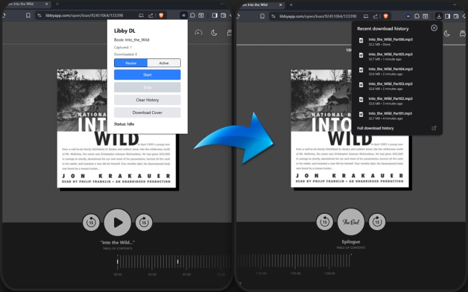

# LibbyDownloader

---

**WARNING: Possibility Of Account Suspension**

---

The following downloader has not been vetted for scale, use with caution. I have not been banned yet, but very possible that I will be. _Always use in ways that don't associate your account with 'botlike behavior'_ (don't just scrape the book and leave, build good credit by leaving the book running anyway).

## Installation:

1. Copy files in some destination folder. `git clone https://github.com/diegotyner/LibbyDownloader`.
2. In your chromium browser, go to `chrome://extensions`. Here, select developer mode and then load unpacked, directing to the `./libby_extension_v2/dist/` folder.
3. After the extension is working, turning off "ask where to save each file..." will make using extension much easier (downloads will begin automatically and you won't be prompted for each mp3 snippet). Here is a [guide to turning it off I used](https://lifehacker.com/make-chrome-ask-where-to-save-downloaded-files-by-chang-1790840372). For me on brave it was slightly different, but mostly the same.

## Usage:

1. Navigate to your libby book on browser.
2. Go all the way to the start of the book (can click Table of Contents in the middle of UI to quickly navigate there).
3. Open up the extension, and click `Clear History` (removes potential clutter from past books)
4. **Reload page** (this step is critical for capturing the first mp3 snippet request, otherwise libby won't rerequest the first snippet).
5. Decide whether to use _Passive_ or _Active_ mode for the downloader.

- Active Mode - Auto-clicks to next Libby chapter and downloads snippets as they are requested. This works well for quickly downloading books.
  - However, for some books this can result in skipping snippets, which can be fixed by using the _Passive_ mode.
- Passive Mode - Turns on the listener for snippet requests, but does not autoclick.
  - Recommended to listen to a book on 2x speed to download it faster.
  - If this is too slow and the autoclicker doesn't work, you can still manually fast forward through the book using the timeline slider.

6. (If using active mode) Set your desired interval between requests (longer is safer)
   - It is intentionally slow to avoid being flagged by Overdrive/Libby. Being flagged could result in account suspension, as many [similar softwares can attest to](https://github.com/PsychedelicPalimpsest/LibbyRip/issues/14)
7. Click `Start` in the pop up. Keep the page open while it slowly captures network requests. Ensure the extension stays in the red "Active" color (this can be made easier by pinning the extension).

Enjoy your downloads!

---

Ignore the `old` folder, those are unused first angles at downloading content.

Future directions:

- Software for quickly implementing audiobook metadata. (this is the python GUI script, ignore for now)
- Splitting mp3s into chapter tracks, shouldn't be too hard to do based on the Libby table of contents menu.

Next steps:

- [ ] Live capture/skip log in popup — show a running log of sniffed chapters as they happen
- [x] Add visual indicator of extension mode (active/passive). \[ended up changing icon color\]
- [x] Add a "passive listening" mode where the auto-clicker is not active
      (remedies the 'skipping snippets' issue).
- [x] Build out mode toggle UI in App.tsx
- [x] Fix the cover download scraper
- [x] Verify that setBookTitle on page load is working properly.
  - [x] Verify that the title on change warning works properly
- [x] Display on popup current book title
